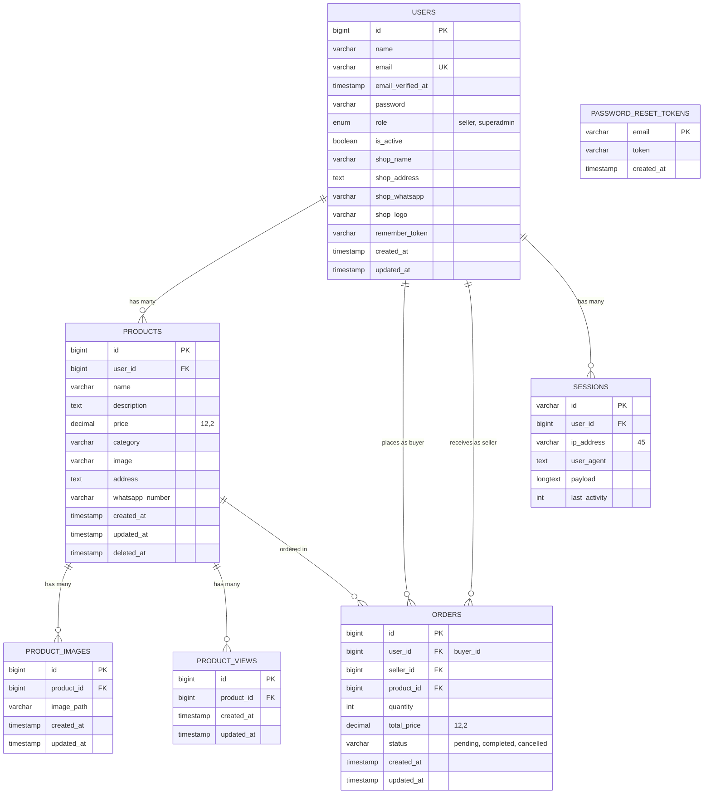

# ERD (Entity Relationship Diagram)
## Laravel WA Marketplace - Permata Klepu

## Deskripsi Relasi

| Relasi | Tipe | Deskripsi |
|--------|------|-----------|
| Users → Products | One-to-Many | Satu user (seller) dapat memiliki banyak produk |
| Users → Orders (buyer) | One-to-Many | Satu user dapat melakukan banyak pemesanan sebagai pembeli |
| Users → Orders (seller) | One-to-Many | Satu user (seller) dapat menerima banyak pesanan |
| Products → Product Images | One-to-Many | Satu produk dapat memiliki banyak gambar |
| Products → Product Views | One-to-Many | Satu produk dapat memiliki banyak view/kunjungan |
| Products → Orders | One-to-Many | Satu produk dapat dipesan berkali-kali |
| Users → Sessions | One-to-Many | Satu user dapat memiliki banyak sesi aktif |

## Role User

- **seller**: Penjual yang dapat mengelola produk dan menerima pesanan
- **superadmin**: Admin Pemdes Desa Klepu yang mengawasi marketplace

## Status Order

- **pending**: Pesanan baru/menunggu
- **completed**: Pesanan selesai
- **cancelled**: Pesanan dibatalkan
