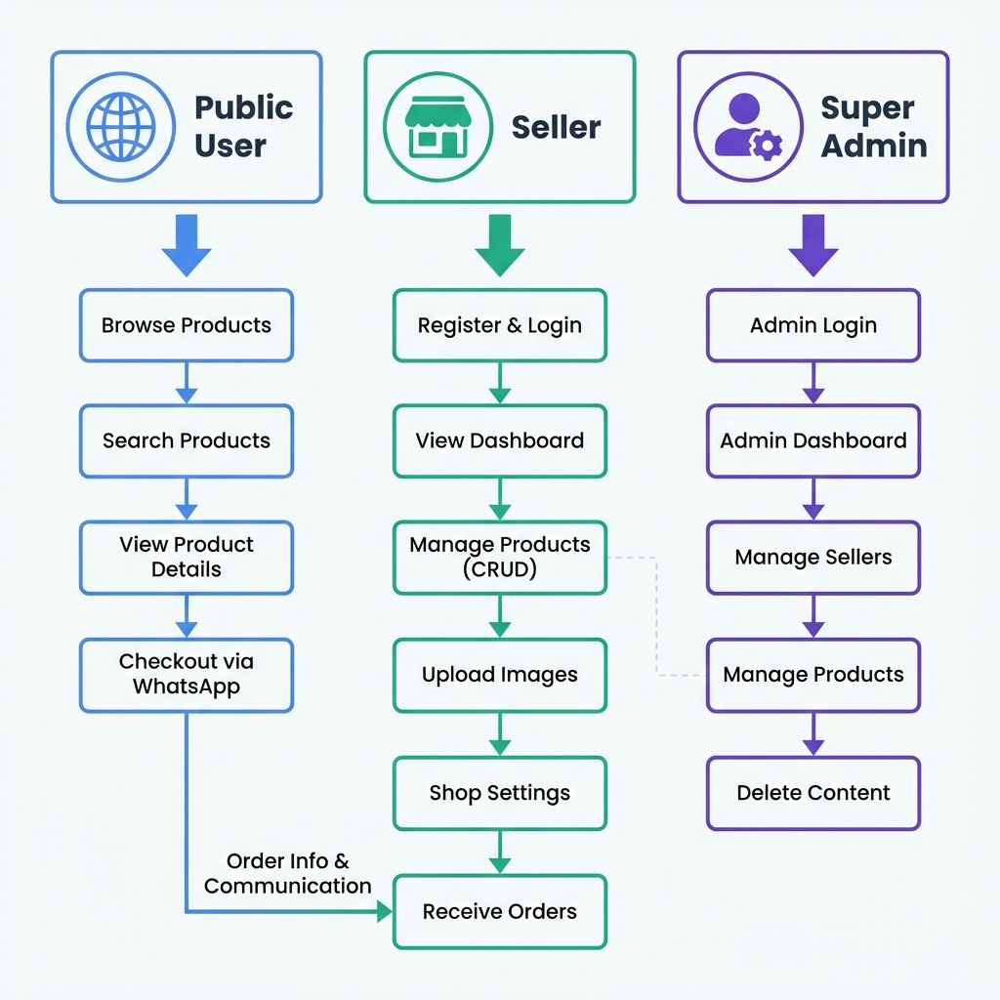
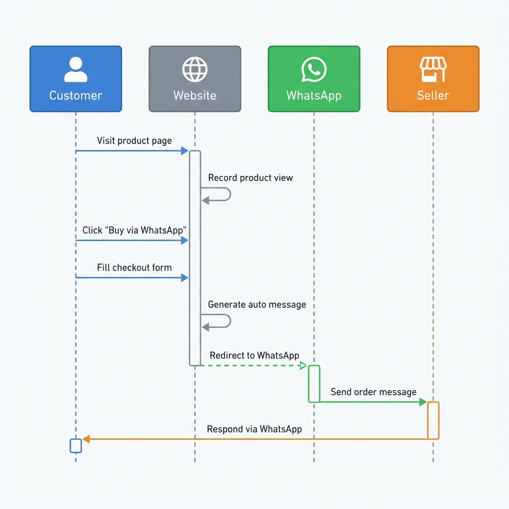
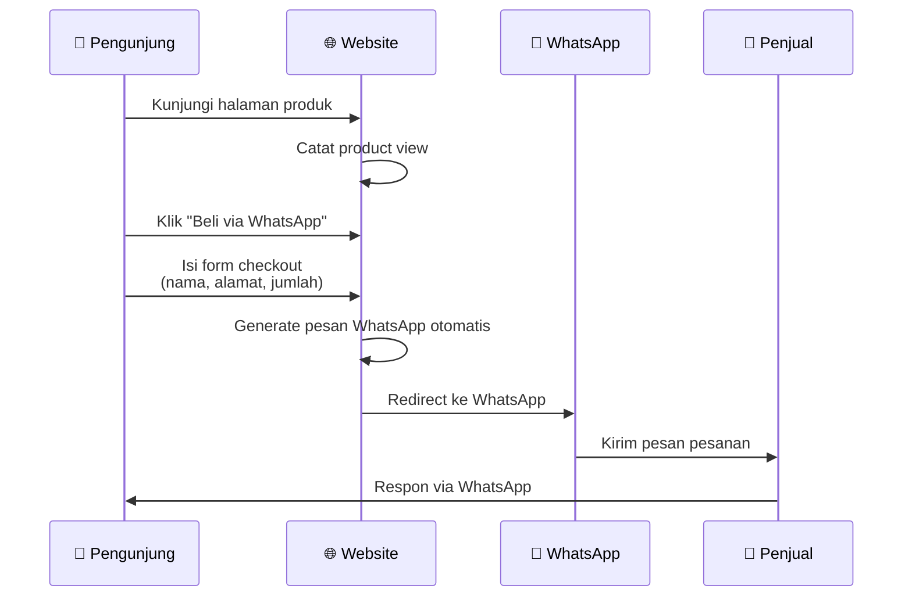
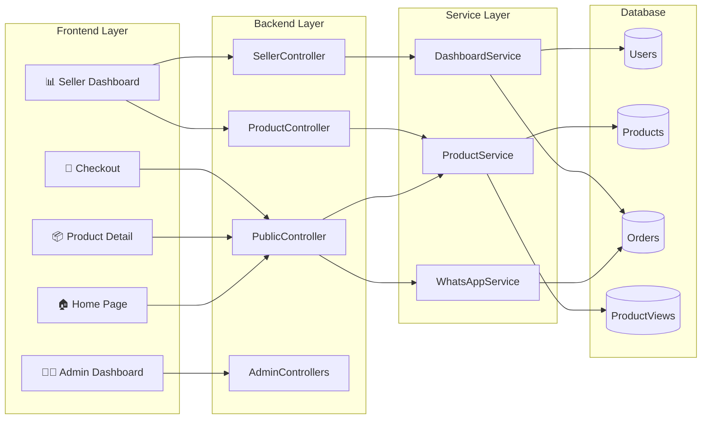
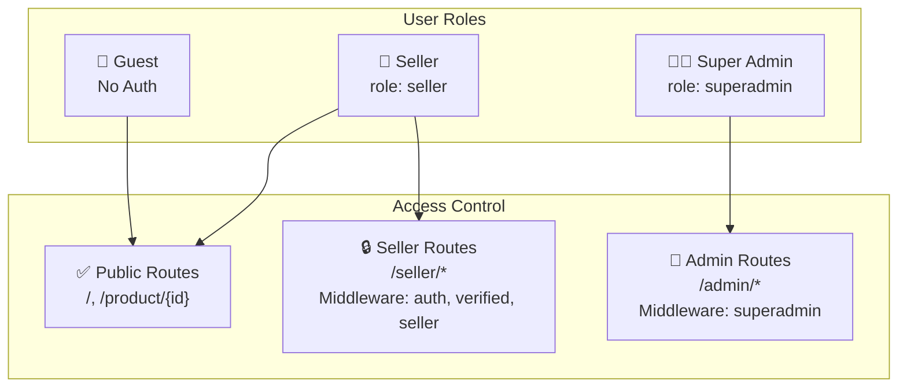

# User Stories - Laravel WA Marketplace

Dokumentasi user stories untuk aplikasi marketplace berbasis WhatsApp.

---

## 🖼️ Visual Diagram

### User Story Diagram

### Checkout Flow Diagram

---

## 📊 Diagram User Story (Mermaid)

```mermaid
flowchart TB
    subgraph Users["👥 Aktor"]
        PUBLIC["🌐 Pengunjung<br>Public User"]
        SELLER["🏪 Penjual<br>Seller"]
        ADMIN["👨‍💼 Super Admin"]
    end

    subgraph PublicStories["🛒 User Stories - Pengunjung"]
        P1["Melihat Halaman Utama<br>& Daftar Produk"]
        P2["Mencari Produk<br>dengan Keyword"]
        P3["Melihat Detail<br>Produk"]
        P4["Melakukan Checkout<br>via WhatsApp"]
    end

    subgraph SellerStories["🏪 User Stories - Penjual"]
        S0["Register & Login<br>sebagai Seller"]
        S1["Melihat Dashboard<br>& Statistik"]
        S2["Mengelola Produk<br>CRUD"]
        S3["Upload Gambar<br>Produk"]
        S4["Mengatur Profil<br>Toko"]
        S5["Menerima Order<br>via WhatsApp"]
    end

    subgraph AdminStories["👨‍💼 User Stories - Super Admin"]
        A1["Login ke<br>Admin Panel"]
        A2["Melihat Dashboard<br>Admin"]
        A3["Mengelola<br>Sellers"]
        A4["Mengelola<br>Produk"]
        A5["Menghapus Seller<br>atau Produk"]
    end

    PUBLIC --> P1
    PUBLIC --> P2
    PUBLIC --> P3
    PUBLIC --> P4

    SELLER --> S0
    SELLER --> S1
    SELLER --> S2
    SELLER --> S3
    SELLER --> S4
    SELLER --> S5

    ADMIN --> A1
    ADMIN --> A2
    ADMIN --> A3
    ADMIN --> A4
    ADMIN --> A5
```

---

## 📋 Detail User Stories

### 🌐 Pengunjung (Public User)

| ID | User Story | Deskripsi |
|----|------------|-----------|
| P1 | **Melihat Halaman Utama** | Sebagai pengunjung, saya dapat melihat halaman utama dengan daftar semua produk yang tersedia |
| P2 | **Mencari Produk** | Sebagai pengunjung, saya dapat mencari produk berdasarkan nama atau kata kunci |
| P3 | **Melihat Detail Produk** | Sebagai pengunjung, saya dapat melihat detail produk termasuk gambar, harga, dan deskripsi |
| P4 | **Checkout via WhatsApp** | Sebagai pengunjung, saya dapat memesan produk dan diarahkan ke WhatsApp penjual dengan pesan otomatis |

---

### 🏪 Penjual (Seller)

| ID | User Story | Deskripsi |
|----|------------|-----------|
| S0 | **Registrasi & Login** | Sebagai penjual, saya dapat mendaftar dan login ke sistem |
| S1 | **Dashboard & Statistik** | Sebagai penjual, saya dapat melihat statistik toko (produk, views, estimasi revenue) |
| S2 | **Kelola Produk (CRUD)** | Sebagai penjual, saya dapat membuat, melihat, mengubah, dan menghapus produk |
| S3 | **Upload Gambar Produk** | Sebagai penjual, saya dapat mengupload multiple gambar untuk setiap produk |
| S4 | **Pengaturan Toko** | Sebagai penjual, saya dapat mengatur nama toko, alamat, nomor WhatsApp, dan logo |
| S5 | **Terima Order** | Sebagai penjual, saya menerima pesanan langsung via WhatsApp dari pelanggan |

---

### 👨‍💼 Super Admin

| ID | User Story | Deskripsi |
|----|------------|-----------|
| A1 | **Login Admin** | Sebagai admin, saya dapat login ke panel admin yang terpisah |
| A2 | **Dashboard Admin** | Sebagai admin, saya dapat melihat overview seluruh marketplace |
| A3 | **Kelola Sellers** | Sebagai admin, saya dapat melihat daftar semua seller dan detailnya |
| A4 | **Kelola Produk** | Sebagai admin, saya dapat melihat semua produk di marketplace |
| A5 | **Hapus Seller/Produk** | Sebagai admin, saya dapat menghapus seller atau produk yang melanggar |

---

## 🔄 Alur Checkout WhatsApp

---

## 🏗️ Arsitektur Sistem

---

## 📝 Role & Permission

